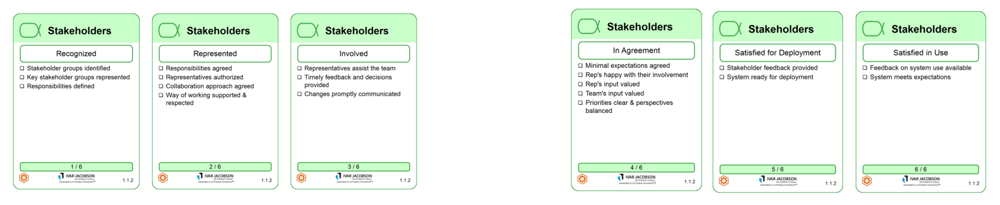

# Grupo SoftwareDestroyers 2.0

Integrantes:  
* Alejandro Fierro - 202173600-k  
* Cristobal Pino - 202104597-k  
* Jorge Toro - 202173613-1  
* Nicolas Horta - 202173532-1  

# Proyecto a trabajar:
Visualizador de imágenes DICOM, barra de búsqueda.

# Estado del Proyecto
Evaluaremos el estado de nuestro proyecto a partir de los Alphas básicos:  

## Stakeholders:

Consideramos que nos encontramos en el estado "Involucrados debido a que ya hemos identificado correctamente a los usuarios y junto al cliente hemos acordado la funcionalidad del proyecto, pero de igual forma aún falta comunicar los ultimos cambios realizados.  
## Oportunidad:  

 Identificamos las distintas necesidades que nos presento el cliente respecto del analisis de las distintas imagenes medicas, asi como las distintas partes interesadas los cuales son los medicos especialistas encargados de trabajar con estas imagenes, es a partir de aqui que fijamos la solucion capaz de satisfacer la necesidad identificada, estableciendo distintos criterios de exito para lograr una buena solucion y el impacto que teiene en las distintas partes interesas, sin embargo, apesar de tener ya una solucion esbozada aun falta manejar los riesgos asociados con la la solucion propuesta.    
## Sistema de Software:  

El software en diseño está aprobado con respecto a los requerimientos del cliente, los aspectos generales y claves del diseño y su funcionalidad fueron definidos y ya trabajados, por lo que se ha alcanzado el estado de “Demostrable”. Si bien cumplimos con la mayoría de los objetivos del estado “Usable” (el sistema es operable, su funcionalidad se puede probar, está documentado todo el desarrollo y su valor), nos falta cumplir con el objetivo de tener un nivel de defectos aceptables ya que no funciona del todo la búsqueda de etiquetas.  
## Trabajo:  

Iniciamos trabajo en nuestro software con metas específicas y formas de medir el progreso del programa a grandes rasgos, por lo que se alcanzó el estado de “Iniciado”. Para poder cumplir con los objetivos del estado “Bajo Control” nos faltó tener más control con los riesgos (encontrar errores a tiempo y arreglarlos con fluidez), el re-trabajo y tener un nivel de consistencia en alcanzar metas más seguro (no atrasarnos en el trabajo de ciertas partes o funcionalidad del software)  
## Forma de Trabajo:  

nuestro equipo ya decidió la forma de trabajo y las herramientas/plataformas que se iban a utilizar para el desarrollo del software (lenguaje, repositorio, librerías, etc). Además logramos coordinar una forma de trabajo que nos acomodara a todos y la pusimos en práctica rápidamente, por lo que el estado de “En Lugar” fue alcanzado. Para poder cumplir con el estado de “Trabajando Bien” nos falta poder alcanzar un nivel de desarrollo predecible acorde con lo que trabajamos y continuamente ajustar esta forma de trabajo, ya que no siempre pudimos avanzar tanto como esperábamos y encontrar alternativas para solucionar ciertos problemas.  

## Equipo:  

Se considera que nos encontramos en el estado "colaborando" debido a que nuestro grupo es el mismo que el de análisis, tenemos la suficiente experiencia trabajando juntos, teniendo así los principios, bases y responsabilidades bien definidas y existiendo un ambiente colaborativo.  
## Requerimientos:  

 Ya identificamos la necesidad de la realización de un nuevo sistema que permita el análisis de imágenes médicas, así como sus distintas partes interesadas en ella, a su vez el propósito y el tema del nuevo sistema son claros; sin embargo, aún buscamos seguir trabajando en los distintos requisitos para satisfacer de mejor manera las distintas necesidades planteadas por el cliente abarcando más necesidades de las que ya trabajamos, es por eso que consideramos que está en aceptable.  
# Alphas Prioritarios
## Alpha Sistema de Software:  
Se ha decidido como prioritario este alpha debido a que es el que se encuentra en un estado más bajo en comparación a los siguientes alphas. Además éste punto resulta fundamental, pues hace referencia al software en si mismo, es decir, es nuestro producto final que queremos completar para cumplir con nuestro objetivo. Para poder avanzar al siguiente estado, debemos trabajar en la calidad de nuestro software, es decir, lograr que el sistema al menos pueda resultar útil y que cumpla con los criterios mínimos que nuestro cliente necesita. Para lograr lo anterior también resulta de suma importancia que sea testeado y que los defectos sean en bajo nivel para poder seguir mejorando.  
## Alpha Stakeholders:  
Como segundo alpha creemos que debemos mejorar nuestra comunicación con los stakeholders, pues resulta de suma importancia llegar a acuerdos para definir una funcionalidad que cumpla con las caracteristicas requeridas por el cliente y los usuarios y que sea realista a la hora de implementar. Tambien se elije este alpha ya que nos permite mejorar a su vez otros alphas, como el alpha del sistema de software, al ir mejorando nuestra comunicacion, se puede tener una visión mucho más clara del software requerido, avanzando ambos alphas de una forma efectiva y complementaria. Otra ventaja es que si por alguna razón no identificamos algún requerimiento importante, una mayor interacción puede ayudarnos a entender mejor el contexto del problema. Para lograr avanzar al siguiente estado, es necesario realizar más reuniones con los stakeholders, aprender a escucharlos y entenderlos mejor y llegar a acuerdos.  
# Riesgos Identificados
* **Riesgo 1**: Cambios en los requisitos del proyecto  
Objetivo afectado: Alcance del proyecto y estabilidad del diseño  
Impacto: Alto  
Probabilidad de ocurrencia: Media  
Medidas de mitigación: Establecer un proceso estándar de implementación de cambios y asegurar la alineación con los stakeholders antes de implementar cualquier cambio.  

* **Riesgo 2**: Vulnerabilidad de la seguridad del software  
Objetivo afectado: Confidencialidad y seguridad de los datos.
Impacto: Muy alto  
Probabilidad de ocurrencia: Baja  
Medidas de mitigación: Implementar medidas de seguridad eficientes, realizar revisiones de seguridad regulares y pruebas de vulnerabilidad.  
